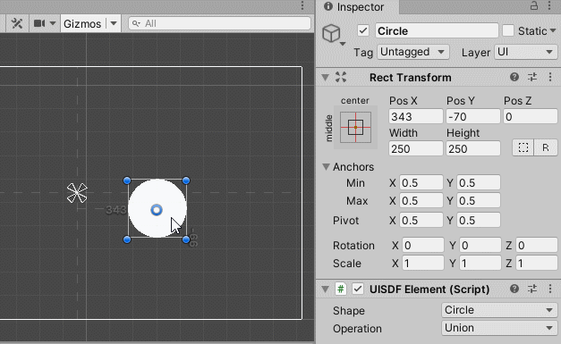
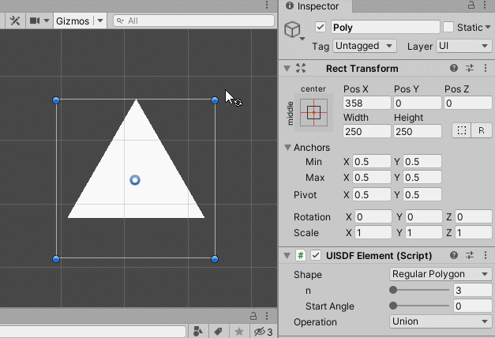

## UnitySDFImage

UnitySDFImage is based on the general SDF algorithm, with some customization for better integration with UGUI, and facilitates the editing and runtime controlling of animation and effects.

The following image is a simple animation including sdf union, intersection, and shape blending.

The following images show bounds editing and parameter updating for a polygon.

